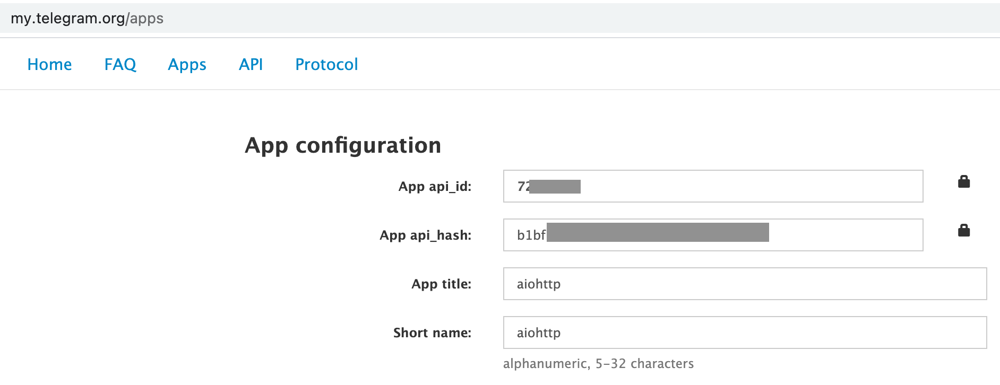
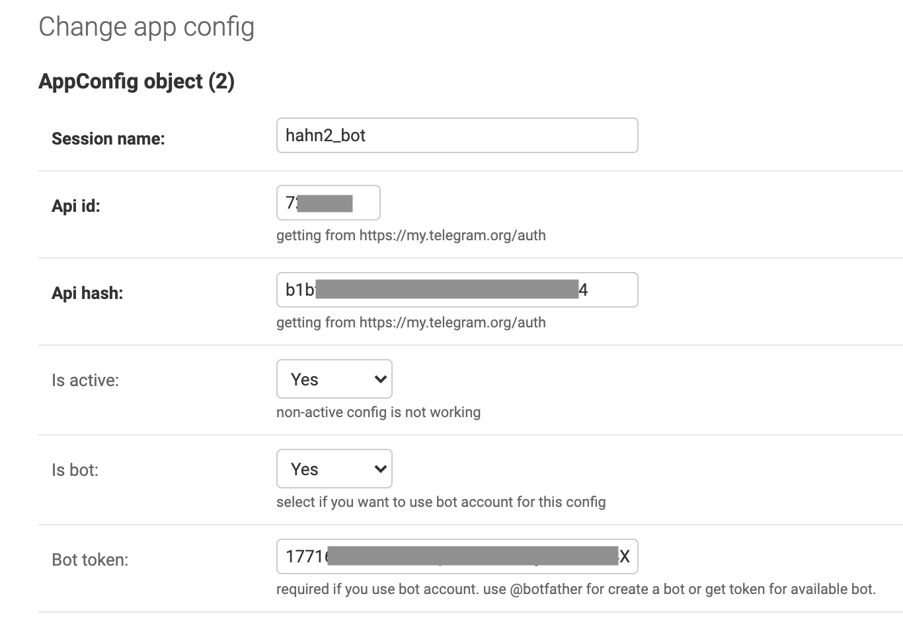

# Django AIOHTTP Project
This project consists of a django server and an async server. The django server manages messages and app configuraitons, while the async server handles messages coming from and responding to a bot.

## Backend Architecture
- The django server is a message manager that stores a message and delete the message if it's viewed. The django server also stores the configuration parameters for a bot.
- The aync server plays an interface role in between the django server and the bot. All the messages that the bot receive are sent to the django server asynchronously. 
- The bot at Telegram responds to a user. It understands a message forming "keyword:strings", where the keyword includes 'new' currently. 

Below is shown the relations among the components.

```
Database <--> django server <--> async server <--> a bot at Telegram <--> a user
                    ^                                     |
                    |_____________ registered ____________|
```

### Endpoints at the django server
- api/v1/create_message
- api/v1/get_message
- api/v1/get_last_active_app_config


### The Bot message structure in json
```
{
    "_": "Message",
    "message_id": 6,
    "from_user": {
        "_": "User",
        "id": 1948897779,
        "is_self": false,
        "is_contact": false,
        "is_mutual_contact": false,
        "is_deleted": false,
        "is_bot": false,
        "is_verified": false,
        "is_restricted": false,
        "is_scam": false,
        "is_fake": false,
        "is_support": false,
        "first_name": "han",
        "status": "recently",
        "language_code": "en"
    },
    "date": "2021-08-01 08:23:28",
    "chat": {
        "_": "Chat",
        "id": 1948897779,
        "type": "private",
        "is_verified": false,
        "is_restricted": false,
        "is_scam": false,
        "is_fake": false,
        "is_support": false,
        "first_name": "han"
    },
    "mentioned": false,
    "scheduled": false,
    "from_scheduled": false,
    "text": "new:hello",
    "outgoing": false
}
```

## Instruction
Run the django server and the async server independently.

## Prerequisite
Two things to do include creating a bot and adding config info on the bot to the django server.

- Go to _my.telegram.org/apps_ and get an api_id and an api_hash. (See Fig. 1)
- Get a token to access the HTTP API from @botfather by sending _/newbot_ to _@botfather_
- Get ready with parameters: api_id, api_hash, and bot_token
- Set AppConfig at the django server to those parameters (See Fig. 2)


Fig. 1: A snapshot of an app configuration at Telegram


Fig. 2: A snapshot of an AppConfig object on the django server

### Run docker compose
```shell
(django_aiohttp) $ docker compose build
(django_aiohttp) $ docker compose up
```

### Alternate run
Instead of running docker containers, you can also run them locally
```shell
$ pipenv shell --python=3
(django_aiohttp) $ pip3 install -r requirements.txt
(django_aiohttp) $ python3 manage.py runserver 0.0.0.0:8001 &
(django_aiohttp) $ python3 async_server
```

### Open browsers to the django and async servers
```
0.0.0.0:8001 for the django server
0.0.0.0:5555 for the async server
```

### Chat with your bot
Open your telegram app and chat with the bot you created.
When you send 'new:hello' to the bot, the async recognizes it as a new message and then creates a post to the django server. The django server replies with an access token to the async server. The async server provides the corresponding id and access token to the bot and it replies to you.
When you send the same message as the bot replied with, the django server fetches the message to the async server with it removed from the database. The async server provides the message to the bot.
```
you > new:hello
bot > 1:2axxxxxxxxxxxxxxxxxxxxxxxxxxxxxxxxxxxxxxxxxxxxxxxxxxxxxxxxxxxxxxx
you > 1:2axxxxxxxxxxxxxxxxxxxxxxxxxxxxxxxxxxxxxxxxxxxxxxxxxxxxxxxxxxxxxxx
bot > hello
```

## Use Cases
Try to understand how the endpoints work on the django server side; open a shell and run use cases as follows.
```shell
(django_aiohttp) $ python
(django_aiohttp) >>> import requests
# UC 1
(django_aiohttp) >>> response = requests.post('http://0.0.0.0:8000/api/v1/create_message', data={'text': 'your text here'}).json()
(django_aiohttp) >>> response
{'id': 4, 'text': 'your text here', 'access_token': '0bxxxxxxxxxxxxxxxxxxxxxxxxxxxxxxxxxxxxxxxxxxxxxxxxxxxxxxxxxxxxxx', 'is_viewed': False}
# UC 2
(django_aiohttp) >>> id, token = response.id, response.access_token
(django_aiohttp) >>> requests.get('http://0.0.0.0:8000/api/v1/get_message/{}/{}'.format(id, token)).json()
# UC 3
(django_aiohttp) >>> url = 'http://0.0.0.0:8000/api/v1/get_last_active_app_config'
(django_aiohttp) >>> response = requests.get(url).json()
(django_aiohttp) >>> response
{'id': 1, 'session_name': 'default_bot_session', 'api_id': 7278174, 'api_hash': 'b1xxxxxxxxxxxxxxxxxxxxxxxxxxxxxx', 'is_active': True, 'is_bot': True, 'bot_token': '1000000000:AAHxxxxxxxxxxxxxxxxxxxxxxxxxxxxxxxx', 'timestamp': '2021-08-01T03:38:06.849604Z'}
```

## Reference 
- [Django Model](https://docs.djangoproject.com/en/3.0/topics/db/models/)
- [Django ORM](https://tutorial.djangogirls.org/en/django_orm/)
- [Model save](https://docs.djangoproject.com/en/3.0/ref/models/instances/)
- [REST framework](https://www.django-rest-framework.org/)
- [AIOHTTP asyncio](https://docs.aiohttp.org/en/stable/)
- [asyncio](https://docs.python.org/3/library/asyncio.html)
- [asyncio walkthrough](https://realpython.com/async-io-python/)
- [use docker](https://www.docker.com/resources/what-container)